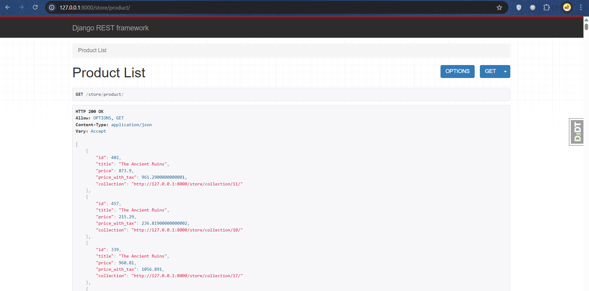
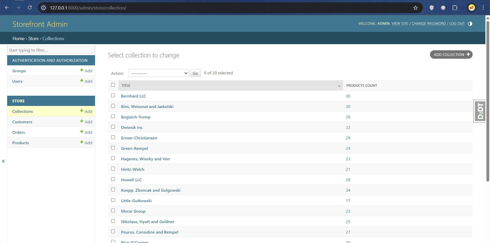

# 🛍️ Storefront

Storefront is a Django-based e-commerce web application that simulates a basic store website. It includes essential store functionalities such as product listing, category browsing, and order management.

<div align="center">
  
  
</div>


## 🚀 Features

- Product management
- Category browsing
- Shopping cart (if implemented)
- Basic admin panel for managing data
- Built with Django framework

## 🧰 Technologies Used

- Python
- Django
- HTML/CSS (Django templates)
- MySQL (default, can be changed to SQLite)

## 🔧 Setup Instructions

1. **Clone the repository:**

   ```bash
   git clone https://github.com/your-username/storefront.git
   cd storefront
   ```

2. **Create a virtual environment and activate it:**
   ```bash
    python -m venv venv
    source venv/bin/activate  # On Windows: venv\Scripts\activate
    ```
3. **Run migrations:**
    ```bash
    python manage.py migrate
    ```
4. **Run the development server:**
   ```bash
    python manage.py runserver
    ```
5. **Visit http://127.0.0.1:8000/ in your browser 🎉**

## 🔑 Admin Access

Create a superuser to access the Django admin panel:
    ```bash
    python manage.py createsuperuser
    ```
Then log in at: http://127.0.0.1:8000/admin/

## 🗃️ Project Structure
    ```bash
    storefront/
    ├── manage.py
    ├── storefront/  # Main project folder
    │   ├── settings.py
    │   └── urls.py
    ├── store/        # Main app
    │   ├── models.py
    │   ├── views.py
    │   ├── templates/
    │   └── ...
    ```


